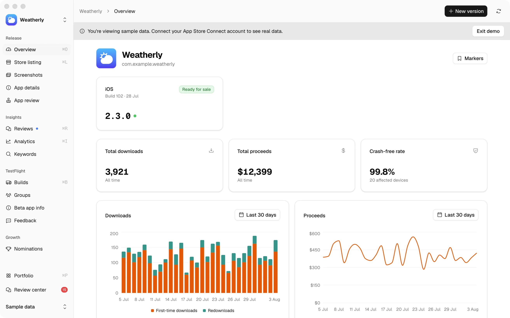
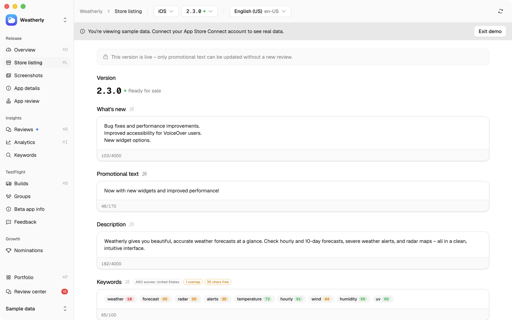
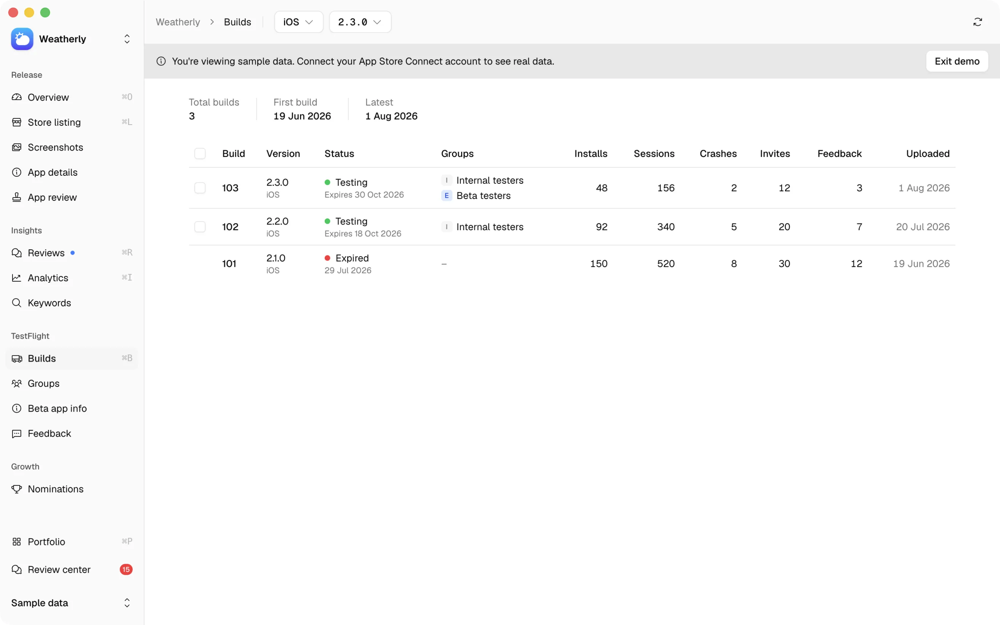
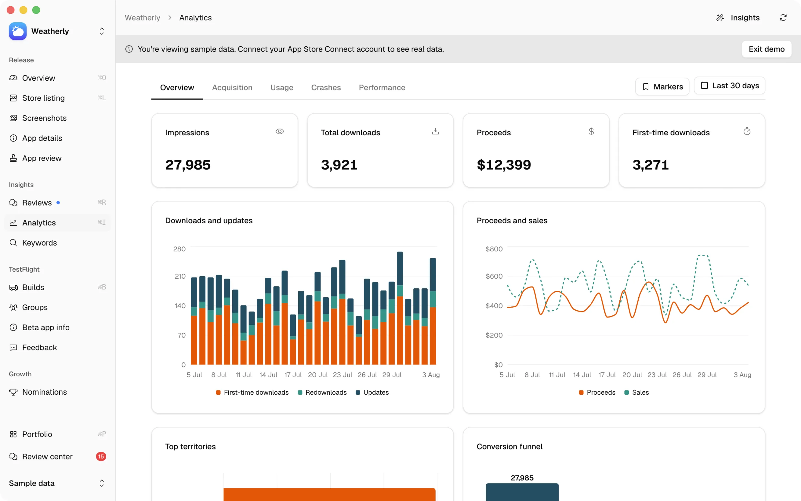
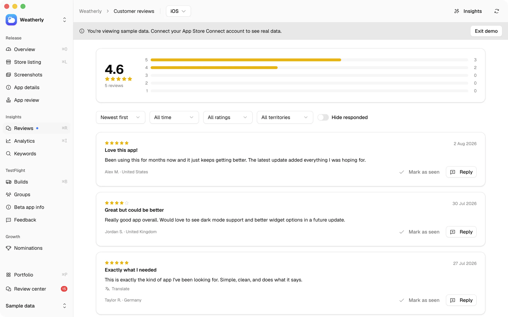
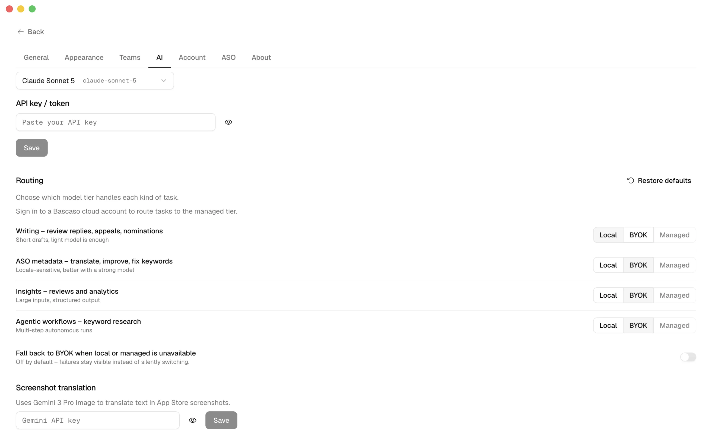
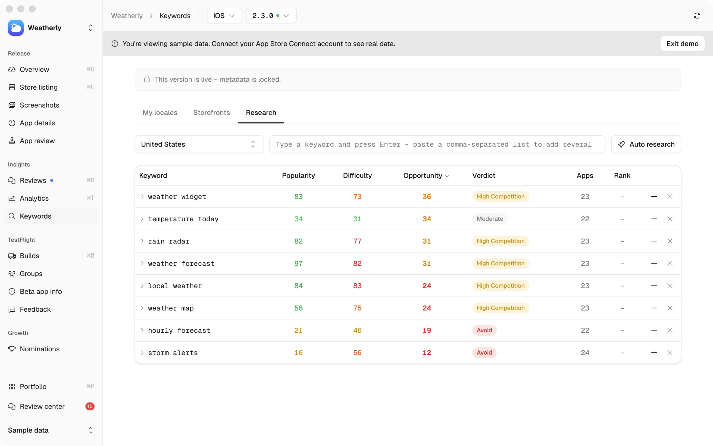
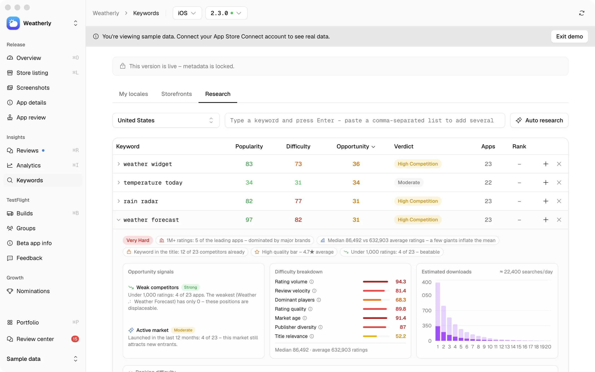
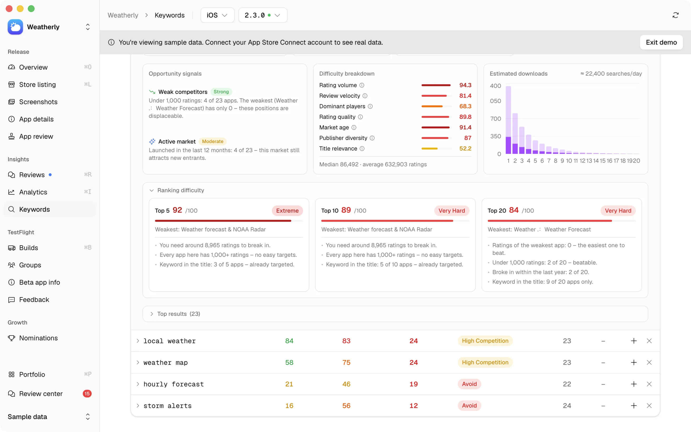

<h1>Bascaso</h1>

<p>
  App Store Connect, with ASO built in.
</p>

<p>
  <a href="https://github.com/kanyacine/bascaso/blob/main/LICENSE"></a>
  <a href="https://github.com/kanyacine/bascaso/actions"></a>
  
  
  
  
</p>

---

A desktop app and self-hosted web dashboard that replaces Apple's App Store Connect. Edit metadata across all locales at once, manage TestFlight builds and testers, review analytics, respond to customer reviews, and submit nominations from a single desktop window.

## Built on two projects

**[itsyconnect-macos](https://github.com/nickustinov/itsyconnect-macos)** by Nick Ustinov is the App Store Connect client underneath: metadata editing, TestFlight, analytics, reviews and screenshots. Bascaso is a fork of it.

**[RespectASO](https://github.com/respectlytics/respectaso)** by Respectlytics is where the ASO methodology comes from. Its Python scoring code was ported to TypeScript (`src/lib/aso/`), and a parity test suite replays vectors generated by running the original Python on fixtures, so both implementations produce the same numbers. Methodology and limits: [docs/ASO.md](docs/ASO.md).

itsyconnect-macos is MIT. RespectASO is AGPL-3.0, which is what makes Bascaso AGPL-3.0 as well.

## What Bascaso adds

**Apple's on-device model.** macOS 26 ships a Foundation Model that runs on the machine. Bascaso talks to it through a small Swift sidecar, so AI features work with no API key, no account and no network call. Its context window is about 4k tokens, so long inputs are refused rather than silently truncated.

**RespectASO's scoring, inside the listing you are editing.** Keyword popularity, difficulty, opportunity and download estimates apply per locale and per storefront, next to the fields they are about, with character budgets and duplicate detection across locales.

**An agentic keyword workflow.** One run searches the App Store for competitors, generates seed keywords, harvests candidates from competitor titles, filters them for relevance, scores each survivor against live iTunes data, ranks them, and composes a title, subtitle and keyword field that respect Apple's character limits. Eight steps, progress reported live, and it runs on your own API key like every other AI feature here.

**Every AI feature with your own key.** Anthropic, OpenAI, Google, xAI, Mistral and DeepSeek are supported. Nothing is held back for a paid tier.

**An account, for people with no key.** Creating a Bascaso cloud account is optional and gives access to a hosted model billed per action. It exists so that someone without an API key can still use the AI features. Everything else in the app works without ever creating one.

## Free and local

The app is free under [AGPL-3.0](LICENSE), with no feature gates, no trial, and no limit on how many apps or developer accounts you manage. Your data stays on your machine. That is the point of the project and it is meant to stay that way.

## Where your data goes

Bascaso is local-first. Your App Store Connect credentials, your app data and your settings live in one SQLite file on your Mac, encrypted with AES-256-GCM under a master key held in the macOS Keychain. Nothing is uploaded, and there is no analytics or telemetry SDK in the app.

There is one exception, and it is opt-in: **the managed AI tier**. If you create a Bascaso cloud account and route tasks to it, the text those tasks need – the metadata, review or prompt in question – is sent to our backend, which forwards it to a model provider. That path involves an account, a server and a payment processor. Everything else in the app keeps working without ever creating one.

See [docs/PRIVACY.md](docs/PRIVACY.md) for exactly what leaves your machine, in which case,
and who else processes it, including the parts that are still open. [docs/MANAGED.md](docs/MANAGED.md)
covers what the managed tier charges and why; [docs/TERMS.md](docs/TERMS.md) covers the sale itself.

<table>
  <tr>
    <td><a href="docs/screenshots/1.webp"></a></td>
    <td><a href="docs/screenshots/2.webp"></a></td>
    <td><a href="docs/screenshots/3.webp"></a></td>
  </tr>
  <tr>
    <td><a href="docs/screenshots/4.webp"></a></td>
    <td><a href="docs/screenshots/5.webp"></a></td>
    <td><a href="docs/screenshots/6.webp"></a></td>
  </tr>
  <tr>
    <td><a href="docs/screenshots/7.webp"></a></td>
    <td><a href="docs/screenshots/8.webp"></a></td>
    <td><a href="docs/screenshots/9.webp"></a></td>
  </tr>
</table>

## Features

**ASO and keyword optimisation** – score a listing, track keyword character budgets per locale and storefront, and detect duplicates between name, subtitle and keyword fields within a locale and across locales. Research keywords against real App Store data, with competitor lookups and download estimates. One-click fix suggestions help maximise coverage across every market. Methodology and limits: [docs/ASO.md](docs/ASO.md).

**Release management** – edit descriptions, keywords, what's new, promotional text, names, and subtitles for every locale. Pick builds, choose release method (manual, automatic, or scheduled), toggle phased rollout. Save everything in one click.

**AI-powered localisation** – translate any field or all fields to one locale or every locale simultaneously. Generate optimised keywords. Draft professional review replies. Translate foreign reviews. Generate appeal text for unfair ratings.

**Three AI tiers** – the on-device Apple model (free, offline), your own API key from Anthropic, OpenAI, Google, xAI, Mistral or DeepSeek, or the managed tier billed per action. Routing is per group of tasks, so drafting can stay on-device while translation goes to a stronger model.

**TestFlight** – manage builds, beta groups, and testers in one interface. Add or remove builds from groups in bulk. Track installs, sessions, and crashes per build. Review tester feedback with device details and screenshots. Mark feedback as done.

**Analytics** – impressions, downloads, proceeds, first-time downloads, sessions, crashes, and conversion funnel. Compare periods, break down by territory, track version adoption. Acquisition sources, usage patterns, and crash reports across separate tabs.

**Customer reviews** – filter by rating, territory, or response status. Translate foreign-language reviews with one click. Draft replies with AI, automatically matching the reviewer's language. Edit and delete existing responses.

**Screenshots** – upload, reorder with drag-and-drop, preview in lightbox, and delete screenshots across all device categories (iPhone, iPad, Mac, Apple TV, Apple Watch, Apple Vision) and locales. Translate screenshots to any locale using Gemini 3 Pro Image – the AI translates marketing text while preserving fonts and layout. Copy base locale screenshots to other locales without translation. Locale picker shows which locales have screenshots at a glance.

**Nominations** – browse, edit, and submit App Store nominations. AI-powered fill generates nomination answers from your app metadata with one click.

**Diff mode** – opt-in setting that accumulates store listing, app details, app review, and keyword changes locally instead of saving to App Store Connect immediately. Review a full before/after diff across all sections and locales, discard individual fields, then push everything in one go.

**MCP server** – optional [Model Context Protocol](https://modelcontextprotocol.io) server lets AI coding tools (Claude Code, Codex, Cursor, OpenCode) manage your app listings directly. Update release notes, translate fields, add locales – all from your terminal. Respects diff mode when enabled. See [docs/MCP.md](docs/MCP.md).

**Self-hosted Docker** – run Bascaso as a web app on your local network or server. One command to start, auto-generated encryption key, persistent SQLite volume. See [self-hosting with Docker](#self-hosting-with-docker).

**Dark mode** – full light and dark theme support, follows your system appearance or can be set manually.

## What it costs

Nothing, unless you use the managed AI tier. The on-device model is free. Your own API key costs whatever your provider charges you, and Bascaso takes no cut of it.

The managed tier is the only paid part: prepaid credits, one credit per action, no subscription required. The app never asks for an account.

## Install

> **Status: not yet released.** There is no published build and no download link yet. Signing, notarisation and auto-update are not wired up (see [docs/RELEASE.md](docs/RELEASE.md) for the current state). Until the first release lands, build from source.

## Build from source

```bash
git clone https://github.com/kanyacine/bascaso.git
cd bascaso
npm install
npm run electron:dev
```

Node 24 is expected – see `.nvmrc`. The setup wizard guides you through connecting your App Store Connect credentials on first launch.

## Self-hosting with Docker

Run Bascaso as a web app on your local network or server.

```bash
docker run -d -p 3000:3000 -v bascaso-data:/app/data ghcr.io/kanyacine/bascaso:latest
```

Or with docker compose:

```bash
docker compose up -d
```

The app will be available at `http://localhost:3000`. A master encryption key is auto-generated and saved to the data volume on first run.

### Reverse proxy with authentication

The Docker container has no built-in authentication. If you expose it beyond your local machine, put it behind a reverse proxy with basic auth.

**Caddy** (recommended – automatic HTTPS):

```
bascaso.example.com {
    basicauth {
        admin $2a$14$... # caddy hash-password
    }
    reverse_proxy localhost:3000
}
```

Generate a password hash with `caddy hash-password`, then paste it into the Caddyfile.

**Nginx:**

```nginx
server {
    listen 443 ssl;
    server_name bascaso.example.com;

    auth_basic "Bascaso";
    auth_basic_user_file /etc/nginx/.htpasswd;

    location / {
        proxy_pass http://localhost:3000;
        proxy_set_header Host $host;
        proxy_set_header X-Real-IP $remote_addr;
    }
}
```

Generate credentials with `htpasswd -c /etc/nginx/.htpasswd admin`.

**Tailscale** – if you just want access from your own devices without exposing anything to the public internet, put the machine on your tailnet and access it via the Tailscale IP. No auth config needed.

### Data persistence

All data (SQLite database, master key) is stored in the `/app/data` volume. Back up this directory to preserve your configuration and cached analytics.

## Development

```bash
npm run electron:dev          # Launch Electron with hot reload
npm run electron:make:dmg     # Build a DMG
npm run test                  # Run tests
npm run test:watch            # Watch mode
npm run test:coverage         # Coverage report
npm run db:generate           # Generate Drizzle migration
npm run db:studio             # Drizzle Studio
npm run lint                  # ESLint
```

Conventions are in [CONTRIBUTING.md](CONTRIBUTING.md); [docs/UI.md](docs/UI.md), [docs/BACKEND.md](docs/BACKEND.md) and [docs/DB.md](docs/DB.md) are required reading before changing UI, server code or the schema.

## Architecture

```
Electron app
├── electron/main.ts      → main process (Keychain, server, window)
├── electron/preload.ts   → minimal context bridge (no FS access)
├── src/proxy.ts          → request interception (replaces middleware.ts)
├── src/app/api/*         → REST API routes (Next.js 16)
├── src/lib/asc/*         → App Store Connect API client
├── src/lib/aso/*         → scoring, keyword research, estimates
├── src/lib/ai/*          → tier routing, prompt templates, streaming
├── src/lib/managed/*     → Bascaso cloud account and session
├── src/db/*              → Drizzle ORM + SQLite (WAL mode)
└── ~/Library/Application Support/bascaso/
    ├── bascaso.db        → SQLite database
    └── master-key.enc    → Keychain-encrypted master key
```

**Stack:** Electron 40 · Next.js 16 · React 19 · TypeScript · Tailwind v4 · shadcn/ui · Phosphor Icons · Geist font · SQLite via better-sqlite3 · Drizzle ORM · Recharts · dnd-kit · Zod · Vercel AI SDK · AES-256-GCM envelope encryption · macOS Keychain

## Releasing a new version

See [docs/RELEASE.md](docs/RELEASE.md). Signing, notarisation and auto-update are not operational yet, and that document says exactly which parts are missing rather than describing an intended end state.

## Contributing

Contributions are welcome. Read [CONTRIBUTING.md](CONTRIBUTING.md) for the development setup, project conventions, and how to submit a pull request. For features, open an issue to discuss the idea first; bug reports and small fixes can go straight in.

## Credits

Bascaso is a fork of [itsyconnect-macos](https://github.com/nickustinov/itsyconnect-macos) by Nick Ustinov, which provides the App Store Connect client this is built on.

The ASO scoring is a TypeScript port of [RespectASO](https://github.com/respectlytics/respectaso) by Respectlytics, kept honest by parity tests that replay vectors generated from the original Python (`tests/unit/aso/parity.test.ts`).

Added here: the on-device Apple model, the agentic keyword workflow, tiered AI routing, and the managed tier.

## License

[AGPL-3.0](LICENSE)
